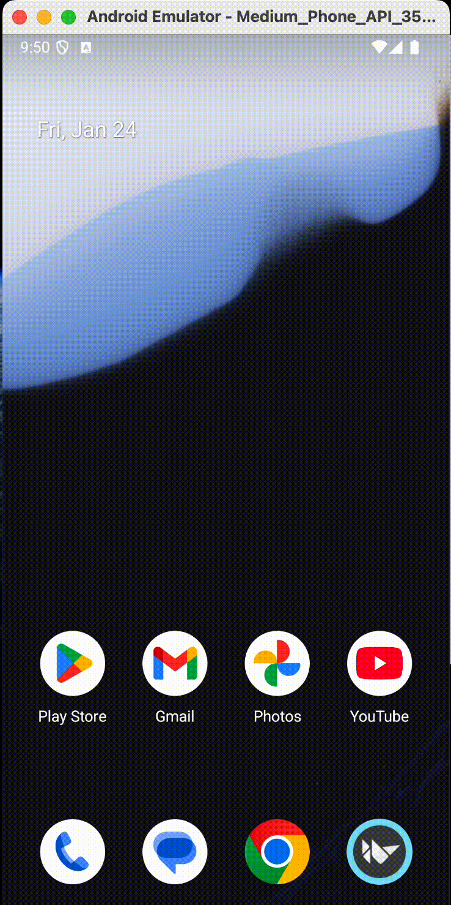

* Other languages：[English](README.md), [中文](README_zh.md)。 
# Project Introduction:
This project is used to identify mobile phone pictures and can identify 1000 types. The most important thing is that this project **does not require an Internet connection, does not require an Internet connection, does not require an Internet connection. Important things should be said three times.**
And this is just a framework, **you can call any model, and you can migrate to other platforms with a small amount of code**, including iOS, Windows, Mac, etc.
So once you are familiar with this framework, you can call many large models locally without an Internet connection to achieve specific functions.
## demo

## Project dependencies:
This project published based on [Buildozer](https://buildozer.readthedocs.io/en/latest/)
The interface is drawn with [kivymd](https://kivymd.readthedocs.io/en/latest/).
So if you plan to develop it yourself, you need to be familiar with the above two projects.
## Release process:
If you have fully read the [Buildozer](https://buildozer.readthedocs.io/en/latest/) documentation, and installed the corresponding installation package. In the console, cd to the root directory of this project and execute: `buildozer -v android debug`. This command will generate a middleware dependency directory `.buildozer` in the root directory of this project. After the execution is completed, a `bin` directory will be generated, and an apk file will be generated in it. Install this file to the phone and use it directly.
**Note that you need to enable the read file permission for this apk**
## Finally, advertise for myself
I am an IT veteran and a full-stack engineer who is familiar with machine learning and backend development. If there are remote work opportunities or technical immigration opportunities, I would be happy to discuss with you. Thank you
If you are interested in the above, please email me. xiao230coki@gmail.com
